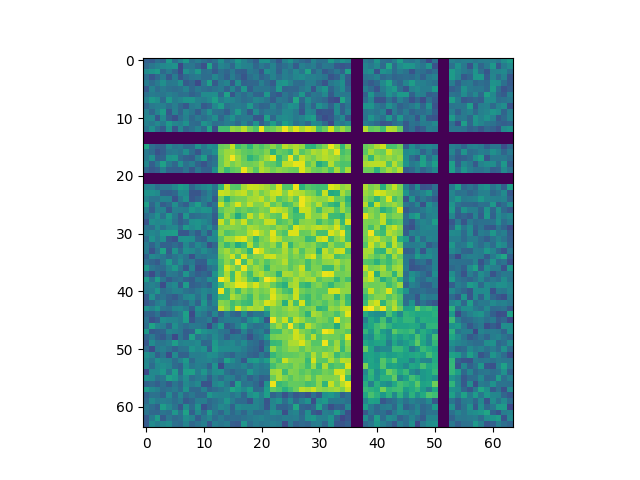
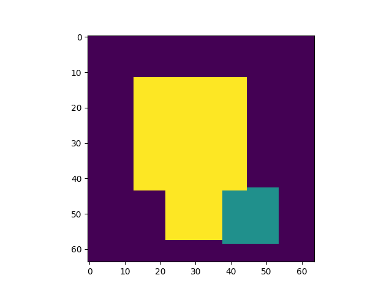
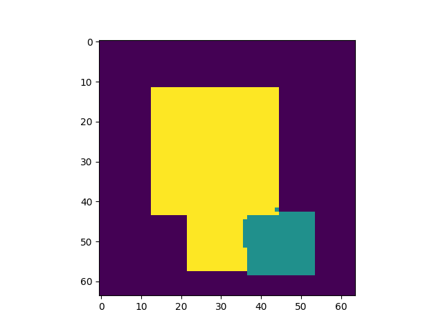

# semantic_segmentation_missing_data

Example of semantic segmentation with missing input data

```bash
sudo docker build ~/semantic_segmentation_missing_data --tag=ssmd
sudo docker run --gpus all -it -v ~/semantic_segmentation_missing_data:/home/semantic_segmentation_missing_data ssmd bash
python src/fit.py
```

The input X is distributed on [0, 4], but is sometimes missing (NA or unobserved),
which is encoded as -1.
The missing values are the vertical and horizontal bars in the example below.
Can the model learn to ignore missing Xs and base its prediction on nearby non-missing pixels?

Input X (including missing values encoded as -1, which show up as purple bars):



True class labels:



Predictions:

